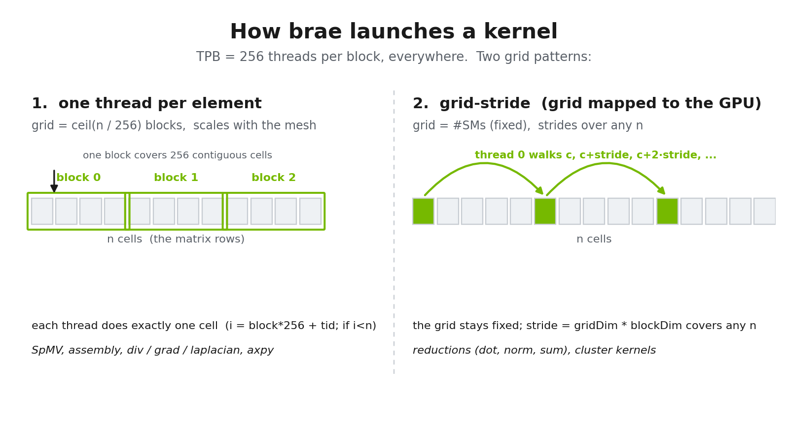

# Contributing to brae

Brae is a clean-room, **device-resident** CUDA reimplementation of OpenFOAM's incompressible solvers. The whole
SIMPLE loop (assembly, momentum, turbulence, and the pressure multigrid) lives on one GPU and never copies fields
back to the CPU between iterations. Everything below exists to protect that property.

Two rules override every other preference in this document:

1. **No regressions.** `ctest` is 158/158 green and must stay green. Numerical changes are validated **cell-by-cell
   against OpenFOAM v2412**, not eyeballed. If your change is meant to be a no-op, prove it is bit-identical.
2. **Faster than OpenFOAM on the CPU, always.** Brae exists to beat a multi-core CPU OpenFOAM run on the same case.
   A change that makes brae slower, or that only wins on a microbenchmark but loses in the real solver, does not
   merge. Speed is a review gate, not a nice-to-have.

If you keep those two in mind, the rest is detail.

## Pull requests

- Keep PRs focused. One change, one story. A kernel rewrite and a refactor are two PRs.
- **Build and test before you open it.** `cmake --build build -j --target brae && ctest --test-dir build`.
- On this host, tests that load the private MPI runtime need the environment supplied before invoking CTest:
  `LD_LIBRARY_PATH=/home/rj/brae-eval/deps/root/usr/lib/x86_64-linux-gnu:/home/rj/brae-eval/deps/root/usr/lib/x86_64-linux-gnu/openmpi/lib:$LD_LIBRARY_PATH`.
  Test scripts inherit this environment and do not set or replace `LD_LIBRARY_PATH` themselves.
- The hosted build-check (`ci.yml`) compiles every PR for sm_80 and sm_90. The full `ctest` runs on a real GB10
  (`gpu-test.yml`) after merge to `main`, so a green build-check is necessary but not sufficient. Say in the PR how
  you validated on a GPU.
- If you change anything numerical, put the OpenFOAM comparison in the PR description: which case, which fields,
  what the L2 difference is. "Looks right" is not a validation.
- Write the commit/PR title in the imperative: "add vanLeer limiter", not "added" or "adds".

## Coding guidelines

Follow the patterns already in the code before inventing your own. Specifically:

- No new third-party dependencies without a strong reason. The build has CUDA, MPI, SCOTCH, zlib, and nothing else.
- Plain C++17 and plain CUDA. Prefer simple `for` loops and explicit code over clever template metaprogramming and
  heavy STL. A kernel should read like what the GPU actually does.
- Keep host and device code honest about arch. Anything that uses features above the minimum (thread-block
  clusters, DSM, cooperative groups) must be guarded (`#if __CUDA_ARCH__ >= 900`) with a runtime fallback, so brae
  still compiles and runs from Ampere (sm_80) through Blackwell. The build-check compiles both paths; do not break
  the pre-Hopper one.
- Comments explain **why**, and map the code to OpenFOAM. A good comment cites the OF file/function the kernel
  mirrors ("OF fvMatrix::solveSegregated ...") so the next person can check faithfulness.
- No invented fallbacks, tiers, or heuristics that OpenFOAM does not have. If OF makes a decision one way, brae
  makes it the same way. When in doubt, read the OF source first and ask a maintainer, do not guess.

### Naming

AMGX-style, and consistent across the tree:

- Files: `snake_case.cu` / `snake_case.cuh`.
- Types: `PascalCase` (`DeviceLduView`, `DeviceSolverPerf`).
- Functions/methods: `camelCase` (`deviceAmul`, `deviceSymGaussSeidel`).
- Everything lives in `namespace brae`.
- Device kernels end in `Kernel` (`clusterAmulKernel`); the host launcher wrapping them does not.

## Writing kernels: know your bottleneck first

A CFD solver is **bandwidth-bound**, but not every kernel is. Before optimizing, decide which kind of task you are
writing, because the two want opposite things. Getting this wrong is the most common way a "faster" kernel ends up
slower in the solver.

| Task | Examples | Bottleneck | Reach for | Avoid |
|---|---|---|---|---|
| **Light** | reductions (dot, norm), the coarse-grid solve, per-step scalars | kernel launch + host sync | fuse launches, keep results on the device, CUDA graphs, clusters + DSM | a host round-trip per iteration; one launch per step |
| **Medium** | SpMV, assembly, whole-mesh field ops (div, grad, laplacian) | memory bandwidth | move fewer bytes: coalesced access, owner-sorted LDU gather, fusion | CSR / cuSPARSE, clusters, multi-stage gathers |

SpMV is the canonical **medium** task and the one every solve leans on, so it gets its own treatment next.

### The matrix is sparse: LDU, not GEMM

Brae has no dense matrix multiply. Every operator (momentum, pressure, each scalar transport) is a sparse
finite-volume matrix in OpenFOAM's **LDU** layout: a `diag` array (one per cell) plus `upper` and `lower`
off-diagonal arrays (one per internal face), addressed through the mesh `owner` / `neighbour` face lists. The only
"matmul" is the sparse matrix-vector product `A * psi` (`deviceAmul`), which every Krylov iteration calls. One thread
per cell (row) gathers its own faces:

![The LDU SpMV: one thread per cell reads its diagonal plus the coefficients on the faces it owns (upper) and the faces where it is the neighbour (lower), and sums them into Apsi[c]](docs/images/spmv-ldu.png)

Two properties are non-negotiable, and every new operator must preserve them:

- **Race-free by construction.** Each thread writes only its own `Apsi[c]`, so the core SpMV needs no atomics. Only
  interface coupling (cyclic, cyclicAMI), where one cell aggregates faces from several interfaces, uses `atomicAdd`.
- **Deterministic gather order.** Owner-then-neighbour is fixed and matches OpenFOAM's `lduMatrix::Amul`, so the
  result is bit-identical run to run and diffable against OF. Do not reorder the gather for a micro-speedup (see the
  SpMV lessons above); the layout already streams at cache bandwidth.

### How a kernel is launched

Two patterns cover almost everything, and `TPB` (threads per block) is **256** across the codebase. Keep it.

**1. One thread per element (the default).** Grid sized to the data: `nBlocks(n) = (n + TPB - 1) / TPB` blocks, a
bounds check, done. This is every element-wise and per-cell / per-face kernel (SpMV, assembly, div / grad /
laplacian, axpy, field updates).

**2. Grid-stride, grid sized to the hardware.** A *fixed* small grid (for example 48 blocks == the GB10's SM count),
where each thread walks the data in strides of `gridDim.x * blockDim.x`. Reach for this only when the launch size
should **not** scale with `n`:

- **Reductions** (dot, norm, sum). You want a bounded number of partials, one per block, then one cheap final
  combine. A data-sized grid would produce millions of partials to reduce; a hardware-sized grid produces exactly
  `#blocks` of them, and the grid-stride loop lets that fixed grid still cover any `n`.
- **Occupancy without over-subscription**: sizing the grid to the SM count keeps every SM busy.
- **Graph capture**: a stable grid dimension makes a captured CUDA graph reusable across calls with different `n`.

Rule of thumb: **map the grid to the data for streaming work, and to the hardware for reductions and cluster kernels.**

### The residency rule dominates everything

The single biggest win in brae is that the SIMPLE loop never leaves the GPU. So:

- A new kernel that forces a **per-iteration host sync** (a `cudaMemcpy` of a scalar, a `.host()` inside the loop)
  is a regression even if the kernel itself is fast. The sync, not the compute, is the cost.
- Reductions stay on the device. The pressure PCG's dot products reduce on-GPU and the scalars live in device
  memory across the whole solve. Match that pattern; do not add a D2H to "just check convergence".

### Light / launch-bound work

When the data is small (coarse levels, a handful of scalars), the GPU is idle and launch overhead dominates. This is
where fusion, CUDA graphs, and clusters + DSM pay off. Measured wins in brae: cluster reduction ~1.76x, a single
fused coarse-grid Jacobi ~1.9x (and **bit-identical**), CUDA-graph V-cycle replay 1.15-1.54x. If you add one of
these, gate it on `deviceClusterSupported()` (or the equivalent) with a plain-kernel fallback.

### Medium / bandwidth-bound work

When the kernel streams the whole mesh, you are limited by how many bytes you move, full stop. **Only byte-reduction
helps.** Fancier access patterns that move the same bytes do not. Three lessons the project already paid for, the
measurements are here so you build on them instead of repeating them:

- **CSR / cuSPARSE for the LDU SpMV**: the per-call CSR gather moves ~2x the traffic and ran **1.25x slower
  in-solver** than the native LDU SpMV (it also broke graph capture). The LDU layout already reaches ~76% effective
  bandwidth through cache, so converting to CSR only adds traffic. Lesson: stay on LDU.
- **Thread-block clusters for SpMV**: L2-bound, not launch-bound, so DSM buys nothing (0.46-0.66x). Lesson: clusters
  pay off for *reductions*, which are launch-bound, not for streaming kernels like SpMV. Match the tool to the
  bottleneck.
- **Two-stage / precomputed gathers and 2D cell-by-face layouts** for the non-orthogonal correction: net-negative
  (0.75-1.03x) and they broke bit-identical, on a kernel that is <1% of runtime. Lesson: do not trade exactness for
  micro-optimizations on a kernel that is not the bottleneck.

### Measure it properly

- Wall-clock alone is **noise** here (clock/boost variance is large). Use a controlled A/B: same binary, same case,
  flip one flag, compare. Report both the kernel time and the **in-solver** time, they often disagree.
- The `ncu` DRAM% metric **lies** on a cache-friendly SpMV (it reads 18% while the effective bandwidth via L2 is
  ~76%). Do the real-matrix A/B, not the metric.
- The bar is the OpenFOAM CPU baseline on the same case at the target mesh size. Below ~1M cells the GPU is
  under-utilized and expected to trail, that is known and is not a per-PR regression. The mandate is at scale.

## Correctness is measured against OpenFOAM

Brae's value is that it matches OpenFOAM. So the definition of "correct" is external:

- Port with the OF source open. Read the OF function (dict to runtime-selection mapping, signs, order of operations)
  **first**, then write the CUDA equivalent, then diff against OF on a real case.
- Target: sub-1% L2 on the fields that matter, bit-identical where the change should be a no-op. If you cannot get
  there, the PR explains why (an FP reduction-order difference is fine and expected; a formula error is not).
- A new numerical path lands **with** the validation that exercises it, not as unvalidated scaffolding.

## License of contributions

Brae is licensed under **AGPL-3.0**. By contributing you agree your contribution is licensed under the same terms.
Because brae is also offered under a separate commercial license by simd-ai, non-trivial contributions require
signing the Contributor License Agreement (a bot will prompt you on your first PR).
