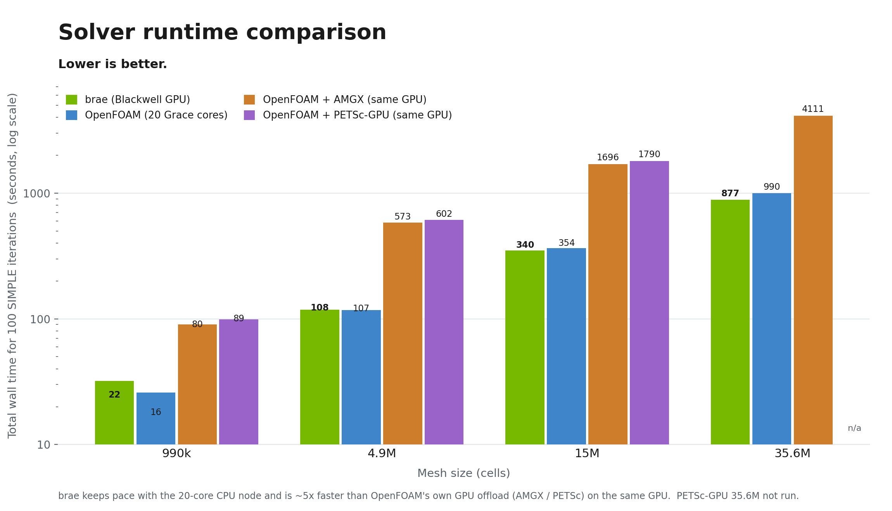
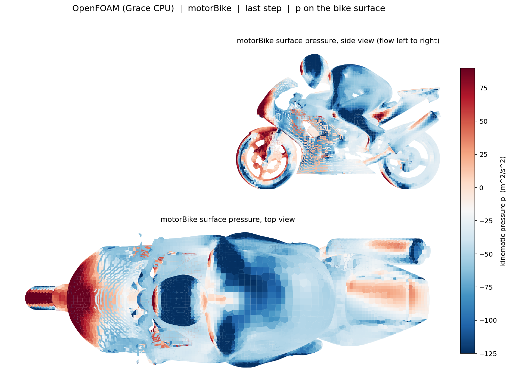
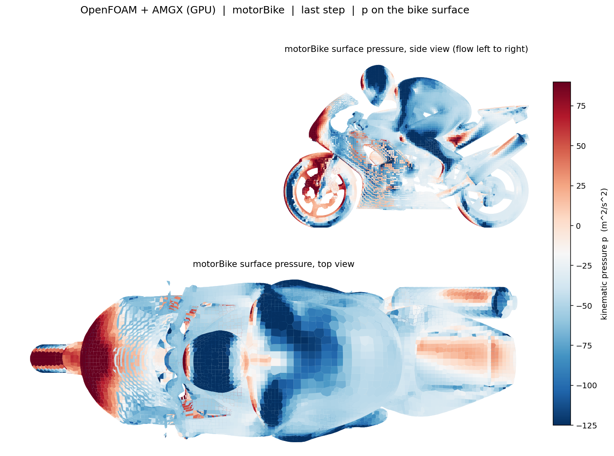
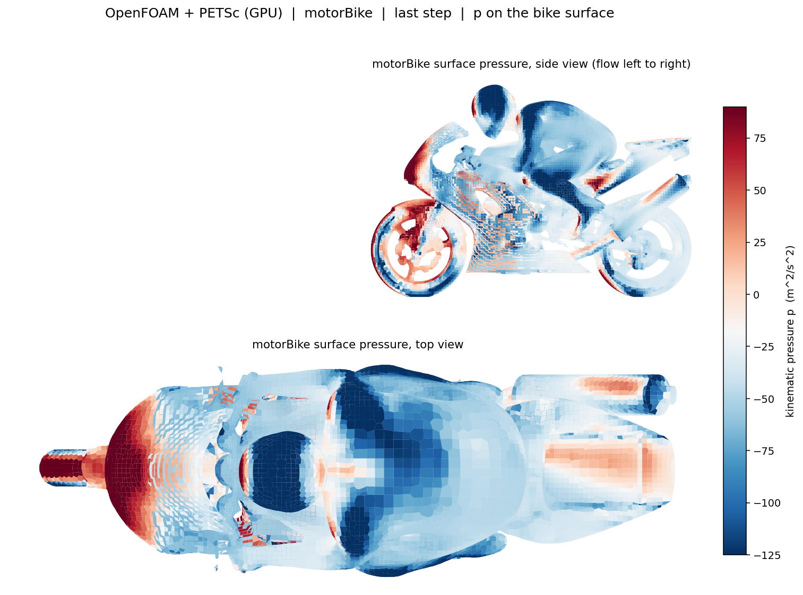
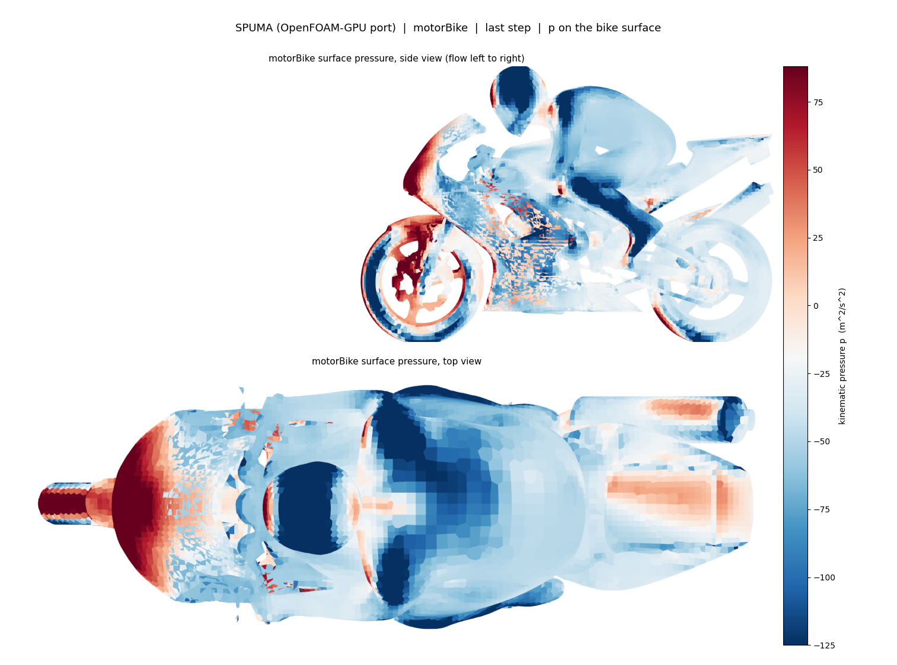

<p align="center">
  
</p>

<p align="center"><b>GPU-native computational fluid dynamics, OpenFOAM-compatible, fully resident on the GPU.</b></p>

<p align="center">
  
  
  
  
  
  
</p>

Brae is a CFD engine that keeps the whole solve on a single GPU. The mesh, the fields, the pressure-velocity
coupling, and every linear solve stay **on the device from the first iteration to the last**, there are no
per-iteration copies back to the CPU. Point it at an existing OpenFOAM case and it writes standard OpenFOAM results,
validated cell-by-cell against OpenFOAM itself, so it drops into your workflow unchanged.

> **~5× faster than GPU-accelerated OpenFOAM, on the same GPU**, because brae keeps the *whole* SIMPLE loop on the
> device instead of offloading only the linear solve and shuttling the matrix host↔device every iteration.

---

## ⚡ How fast



*Total wall time for 100 SIMPLE iterations (scaled-pitzDaily) on a single NVIDIA GB10, log scale, lower is better. At 35.6M both SPUMA and OpenFOAM+PETSc-GPU diverged to NaN on that extreme-aspect-ratio mesh at stock solver settings; brae, OpenFOAM-CPU, and OpenFOAM+AMGX complete it as timing cases.*

- **~4-5× faster than every other GPU approach on the *same* GPU** — OpenFOAM's own AMGX and PETSc-GPU offloads, *and*
  the [SPUMA](https://gitlab-hpc.cineca.it/exafoam/spuma) OpenFOAM-GPU port (CINECA / EU-exaFOAM), the closest
  full-residency peer. The payoff of keeping the whole loop resident: the offloads pay a per-iteration matrix
  rebuild-and-copy, and SPUMA's managed-memory port leaves the GPU only lightly loaded at these mesh sizes. (SPUMA
  itself overtakes the AMGX/PETSc offloads once the mesh is large; brae stays ahead of all three.)
- **Parity-to-ahead of a 20-core Grace CPU node once the mesh is large**, and the lead widens with size (the GPU is
  under-utilized below ~1M cells, so it trails there, and saturated at scale, where it pulls ahead).
- **< 1% from OpenFOAM**, validated cell-by-cell. It is not bit-identical, and is not meant to be: parallelising the
  arithmetic on the GPU reorders the floating-point sums (and loops over cells rather than faces), so the truncation
  error lands slightly differently than on the CPU. See [why the results are not bit-identical](docs/getting-started.md#why-the-results-are-not-bit-identical).

GB10 is a deliberately conservative baseline: its Blackwell GPU shares the Grace CPU's unified LPDDR5x memory (**no
HBM**), so on this box the GPU cannot structurally out-run the CPU, parity itself is the ceiling here. On a GPU with
HBM (H100 ~3.3 TB/s, GH200 ~4 TB/s) the same code projects to an **order-of-magnitude speedup, roughly 8-12×** a CPU
node, with no migration tax.

See [docs/performance.md](docs/performance.md) for methodology and the full curve.

---

## 🎯 Same case, same answer

motorBike (2.9M cells, k-omega SST, 500 iterations), surface pressure at the last step, all five rendered on one
shared color scale. Brae, OpenFOAM on the Grace CPU, OpenFOAM's own GPU offloads (AMGX, PETSc), and the SPUMA
OpenFOAM-GPU port produce a visually indistinguishable field and agree to within **~1.6% on drag (Cd)**. Red is the
stagnation pressure on the front wheel and nose, blue is the suction over the helmet, back, and tank.

| brae (Blackwell GPU) | OpenFOAM (Grace CPU) |
|:---:|:---:|
|  |  |
| **OpenFOAM + AMGX (GPU)** | **OpenFOAM + PETSc (GPU)** |
|  |  |
| **SPUMA (OpenFOAM-GPU port)** |  |
|  |  |

See [the full five-way comparison](bench/results/motorbike_comparison.md) for the drag and lift numbers (brae, OpenFOAM-CPU, AMGX, PETSc, and the SPUMA OpenFOAM-GPU port).

---

## 💡 Why brae

Most "OpenFOAM on GPU" approaches offload only the linear solver: the matrix is rebuilt on the CPU and copied to the
GPU *every iteration*, and the assembly, momentum, and turbulence still run on one CPU core. Brae is different, it is
**device-resident**: the entire solver loop lives on the GPU, so there is no migration tax and no serial-CPU
ceiling.

- **Drop-in**, reads your existing `0/ constant/ system/` case (ASCII or binary mesh), writes standard time
  directories you can open in ParaView / `postProcess`.
- **Faithful**, a clean-room reimplementation of OpenFOAM v2412, validated **cell-by-cell** against it (sub-1% on
  the fields that matter).
- **Fast where it counts**, one Blackwell GPU keeps pace with a 20-core Grace CPU node, and pulls ahead as the mesh grows.

The speedup is that residency, not any one allocator trick: brae keeps its fields and OpenFOAM's LDU matrix in
explicit, pooled device memory and does zero host-device copies per iteration (pinned memory is used only for a
couple of reduction scalars). See [docs/memory-model.md](docs/memory-model.md) for the full data-layout rationale
(why a device pool over pinned/`thrust`, and why LDU-gather over CSR/cuSPARSE).

---

## 📦 Install

Requires an NVIDIA GPU, Ampere or newer (Ampere, Ada Lovelace, Hopper, Blackwell, including HBM datacenter cards like
H100 / GH200 / B200), plus CUDA 12.4+ (13.x recommended) and a C++17 toolchain. Brae is standard CUDA, so newer
architectures are just a recompile.

```bash
# dependencies: cmake ≥ 3.24, CUDA toolkit, an MPI (OpenMPI), SCOTCH, zlib
git clone https://github.com/simd-ai/brae.git
cd brae
cmake -B build -DCMAKE_CUDA_ARCHITECTURES=<your_arch>
cmake --build build -j --target brae
```

<details>
<summary>Set <code>&lt;your_arch&gt;</code> to your GPU's compute capability</summary>

| GPU | `<your_arch>` |
|---|---:|
| GB10 | 121 |
| RTX 50-series | 120 |
| GB300 / B300 | 103 |
| B200 / GB200 | 100 |
| H100 / GH200 | 90 |
| RTX 40-series / L40 | 89 |
| RTX 30-series | 86 |
| A100 | 80 |

</details>

---

## 🚀 Get started

Run brae from inside any existing OpenFOAM (`simpleFoam`) case, exactly as you would run `simpleFoam` itself:

```bash
cd yourCase                       # your OpenFOAM case directory (0/  constant/  system/)
brae                              # solve in the current directory
brae -case /path/to/yourCase      # or run it from anywhere

# Optional: partition once (brae's analogue of decomposePar), then run warm
brae -partition -case yourCase    # cold: build + cache the mesh and AMG hierarchy, then exit (no solve)
brae -case yourCase               # warm: reloads the cache and solves (fast startup)
```

Brae reads your standard case (dictionaries + mesh), auto-partitions for the GPU (no `decomposePar`), and writes
ordinary time directories. A plain `brae` run does everything on its own. The optional `-partition` step just does
the one-time mesh + AMG-hierarchy prep up front and caches it, so later runs of the same mesh start warm, handy for
benchmarking and for re-running a mesh many times.

The [**fast path**](docs/performance.md) (device-resident solver + mixed-precision multigrid, accuracy-preserving) is
**on by default**; opt out with `BRAE_PCG_DEVICE=0 BRAE_AMG_FP32=0`.

### Run several cases across GPUs

For a mesh-independence study or a parameter sweep, run several cases at once, one per GPU, straight from brae
(each case fully device-resident on its own card; extra cases queue as GPUs free up):

```bash
brae -cases mesh_coarse mesh_medium mesh_fine   # one case per GPU
BRAE_JOBS=2 brae -cases caseA caseB caseC       # cap how many run at once
```

Each case's OpenFOAM-style residual output is tagged `[GPUn case]` so the combined log stays greppable, and it
finishes with a per-case summary table (cells, iterations, residuals, wall time, status). If there are more cases
than GPUs it prints a warning and queues the extras. On a single-GPU machine the same command runs the cases back to
back. Override the detected GPU count with `BRAE_GPUS`.

---

## 🌊 Solvers

Brae implements OpenFOAM's incompressible solver family one solver at a time, each fully device-resident and
validated cell-by-cell against OpenFOAM. It started with `simpleFoam` (steady incompressible) as the proof of
concept.

| Solver |
|---|
| [`simpleFoam`](docs/solvers/simplefoam.md) |
| others (soon) |

Today brae runs [`simpleFoam`](docs/solvers/simplefoam.md).

---

## 🚧 Roadmap

See [the roadmap](docs/roadmap.md) for the current scope and what is coming next.

---

## 📚 Documentation

- [Getting started](docs/getting-started.md), install, first run, verifying against OpenFOAM
- [Solvers](#-solvers), per-solver coverage
- [Performance & tuning](docs/performance.md), the `BRAE_*` knobs, benchmarks, the residency story
- [Memory model & data layout](docs/memory-model.md), device pool vs pinned, LDU-gather vs CSR, and why
- [Roadmap](docs/roadmap.md), scope and what is coming next
